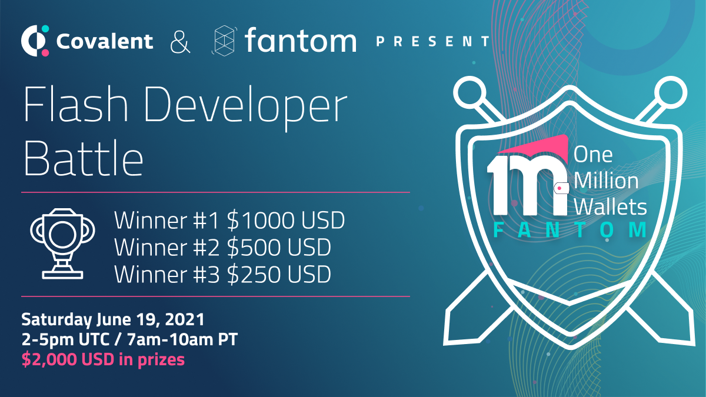

# Welcome to the Flash Developer Battle!



&nbsp;
## Objective
To build the best front-end dashboard you can in 3 hours using ONE of the assigned **swap** datasets. 

&nbsp;
## Submissions
To complete your submission, simply answer the questions in `Submission.md` and hit the `Submit` button in your Repl within 3 hours of the announced start time.

&nbsp;
## Rules

&nbsp;
1. You have a maximum of 3 hours from the announced start time for your submission to be received.

&nbsp;
2. You must host your code publicly on Replit. Replit supports importing repos from GitHub. Ideally your live dashboard is also hosted on Replit but can be hosted anywhere you like.

&nbsp;
3. Please use the assigned DEX data for building your dashboard. You can use the provided cleansed CSV files or our API. You can find the DEX data assigned to each team in `data/DEX_Data_Assignment`. 

&nbsp;
4. You can use any front-end framework in any programming language you like.

&nbsp;
5. Please reach out on the live Zoom call for any assistance.

&nbsp;
6. The total prize pool of $2,000 USD (equivalent) is broken down as follows:
  * $1,000 first place prize
  * $500 second place prize
  * $250 third place prize
  * $250 allocated at Covalent's discretion


&nbsp;
## Resources
Here are some sample open-source repos and dashboard examples you can consider using for your project:

* https://github.com/facebook/create-react-app
* https://github.com/tradingview/lightweight-charts
* https://github.com/pancakeswap/pancake-frontend
* https://replit.com/@ch1ck3n/epic-dashboard-template


## New Covalent API Endpoints 
We are super excited to be rolling out a new set of universal endpoints which can be applied to a *Uniswap clone* to fetch swap, volume, liquidity, pool, token and other key metrics for DEXs. While cleansed, tabular DEX data is provided for the purposes of this dev battle, you are welcome to try out these endpoints for your dashboard. Simply use:
* `spiritswap`
* `sushiswap`

in place of `dexname` in the following API endpoint URLs:

&nbsp;
1. Get the health status of the Uniswaplike v2 dex. Returns the latest sync block
```
https://api.covalenthq.com/v1/{chain_id}/uniswaplikev2service/{dexname}/health/?
```
&nbsp;
2. Get Uniswaplike v2 Ecosystem data. Returns total volume and total liquidity chart data over the last 30 days.
```
https://api.covalenthq.com/v1/{chain_id}/uniswaplikev2service/{dexname}/ecosystem/?
```
&nbsp;
3. Get Uniswaplike v2 pool data.
```
https://api.covalenthq.com/v1/{chain_id}/uniswaplikev2service/{dexname}/pools/?
```
&nbsp;
4. Get Uniswaplike v2 pool data by address. Includes 7 day and 30 day volume and liquidity chart data.
``` 
https://api.covalenthq.com/v1/{chain_id}/uniswaplikev2service/{dexname}/pools/address/{address}/?
```
&nbsp;
5. Get Uniswaplike v2 pool transactions by address. Returns the latest 20 swap, mint and burn events.
```
https://api.covalenthq.com/v1/{chain_id}/uniswaplikev2service/{dexname}/pools/address/{address}/transactions/?
```
&nbsp;
6. Get Uniswap Like pool v2 data.
```
https://api.covalenthq.com/v1/{chain_id}/uniswaplikev2service/{dexname}/tokens/?
```
&nbsp;
7. Get Uniswaplike pool v2 data by address. Includes 7 day and 30 day volume, liquidity and pricing chart data.
```
https://api.covalenthq.com/v1/{chain_id}/uniswaplikev2service/{dexname}/tokens/address/{address}/?
```
&nbsp;
8. Get Uniswaplike v2 pool token transactions by address. Returns the latest 20 swap, mint and burn events.
```
https://api.covalenthq.com/v1/{chain_id}/uniswaplikev2service/{dexname}/tokens/address/{address}/transactions/?
```
&nbsp;
9. Get address Uniswaplike v2 address exchange balances. Returns the Lp balances of the address. 
```
https://api.covalenthq.com/v1/{chain_id}/uniswaplikev2service/{dexname}/address/{address}/balances/?
```
&nbsp;
10. Get Uniswaplike v2 address exchange liquidity transactions.
```
https://api.covalenthq.com/v1/{chain_id}/uniswaplikev2service/{dexname}/address/{address}/transactions/?
```

Check out `index.js` for a working code sample using one of these endpoints!